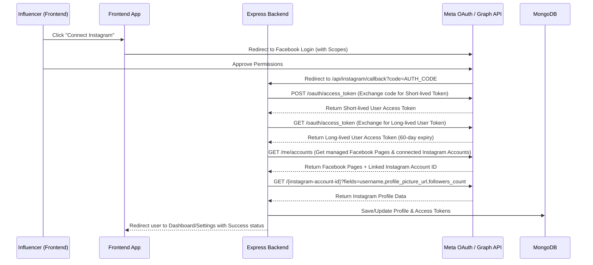

# Phase 1: Instagram Integration Planning

Welcome to the design and planning phase of the Instagram Integration! As a backend developer, integrating third-party platforms like Meta (Facebook/Instagram) is one of the most common and valuable tasks you will work on. 

This document acts as your comprehensive guide to how the Instagram integration works, the API concepts involved, the OAuth 2.0 flow, and our database and backend architecture. Read this thoroughly before we write any code in the next phases.

---

## 1. Instagram Graph API vs. Basic Display API

When integrating Instagram, Meta offers two separate APIs:
1. **Instagram Basic Display API**: Designed for read-only access to basic profile info and media of *any* type of Instagram account (Personal, Creator, Business). **Note: This API is deprecated by Meta and does not allow fetching advanced metrics like follower counts or differentiating Reels/Videos properly.**
2. **Instagram Graph API (Our Choice)**: Designed for professional Instagram accounts (**Creator** and **Business**). It allows us to fetch followers, read media (Posts, Reels, Videos), view insights, and manage comments. Because we need follower counts and advanced media classification for our influencer platform, we **must** use the Instagram Graph API.

---

## 2. Creator vs. Business Accounts

The Instagram Graph API only works with **Professional Accounts**. There are two types:
* **Creator Accounts**: Best suited for public figures, content creators, artists, and influencers.
* **Business Accounts**: Best suited for retailers, local businesses, brands, and organizations.

### The Meta Page Requirement
To use the Instagram Graph API, the influencer's Instagram Professional Account **must be linked to a Facebook Page** that they manage. 
* Personal accounts cannot be used.
* Professional accounts *not* connected to a Facebook Page cannot be queried via the Graph API.

Our onboarding flow must guide influencers to:
1. Switch their Instagram account to a Professional (Creator/Business) account.
2. Create a Facebook Page (if they don't have one) and link their Instagram account to it.
3. Log in via Facebook and authorize our app.

---

## 3. Required Scopes & Permissions

When the user logs in via Facebook, we must request specific permissions (scopes) to access their Instagram data:

| Permission Name | Purpose |
| :--- | :--- |
| `instagram_basic` | Read basic profile details (username, profile picture) and media metadata. |
| `pages_show_list` | Retrieve a list of Facebook Pages managed by the logged-in user. |
| `pages_read_engagement` | Read engagement data and metadata from the managed Facebook Pages. |
| `public_profile` | Access the user's basic Facebook profile information. |

---

## 4. The OAuth 2.0 Flow: Step-by-Step

Since the Instagram Graph API runs on the Facebook Graph platform, the OAuth flow goes through Facebook Login.



### Detailed Breakdown of the Steps:

#### Step 1: User Initiates Connection
The influencer clicks "Connect Instagram" on the frontend. This redirects them to the Facebook Authorization URL:
```text
https://www.facebook.com/v18.0/dialog/oauth?
  client_id=YOUR_FACEBOOK_APP_ID
  &redirect_uri=YOUR_BACKEND_CALLBACK_URL
  &scope=instagram_basic,pages_show_list,pages_read_engagement,public_profile
  &state=YOUR_SECURE_STATE
```

#### Step 2: Code Retrieval
After the influencer logs in and grants permissions, Facebook redirects them back to our backend redirect URI:
```text
GET /api/instagram/callback?code=AQB...&state=YOUR_SECURE_STATE
```
* **Authorization Code (`code`)**: A short-lived, single-use code that we will exchange for an access token.

#### Step 3: Get Short-Lived Access Token
Our backend takes the `code` and makes a request to Meta's token exchange endpoint:
```text
GET https://graph.facebook.com/v18.0/oauth/access_token?
  client_id=YOUR_FACEBOOK_APP_ID
  &redirect_uri=YOUR_BACKEND_CALLBACK_URL
  &client_secret=YOUR_FACEBOOK_APP_SECRET
  &code=THE_AUTHORIZATION_CODE
```
Meta responds with a **Short-Lived User Access Token** (valid for 1 to 2 hours).

#### Step 4: Upgrade to Long-Lived Access Token
To avoid asking the influencer to log in every 2 hours, we must exchange the short-lived token for a **Long-Lived Access Token** (valid for 60 days):
```text
GET https://graph.facebook.com/v18.0/oauth/access_token?  
  grant_type=fb_exchange_token&           
  client_id=YOUR_FACEBOOK_APP_ID&
  client_secret=YOUR_FACEBOOK_APP_SECRET&
  fb_exchange_token=SHORT_LIVED_ACCESS_TOKEN
```
Meta responds with the long-lived token:
```json
{
  "access_token": "LONGLIVED_ACCESS_TOKEN",
  "token_type": "bearer",
  "expires_in": 5184000
}
```

#### Step 5: Discover the Connected Instagram Account
We make a request using the long-lived token to find the Facebook Pages managed by the user, requesting the linked Instagram business accounts:
```text
GET https://graph.facebook.com/v18.0/me/accounts?fields=instagram_business_account{id,username,name},name,access_token&access_token=LONGLIVED_ACCESS_TOKEN
```
This returns a list of pages. We look for a page that has an `instagram_business_account` object. If found, we extract the `id` of that Instagram Business Account.

#### Step 6: Fetch Instagram Profile Stats & Media
We make two calls using the Instagram Business Account ID:
1. **Get Profile Info**:
   ```text
   GET https://graph.facebook.com/v18.0/{instagram-business-account-id}?fields=username,name,profile_picture_url,followers_count&access_token=LONGLIVED_ACCESS_TOKEN
   ```
2. **Get Media Items**:
   ```text
   GET https://graph.facebook.com/v18.0/{instagram-business-account-id}/media?fields=id,caption,media_type,media_url,permalink,thumbnail_url,timestamp,username&access_token=LONGLIVED_ACCESS_TOKEN
   ```

---

## 5. Token Lifecycle & Refreshes

* **Short-Lived Access Token**: Lasts 1-2 hours.
* **Long-Lived Access Token**: Lasts 60 days.
* **Token Refresh**: We can refresh a long-lived token before it expires by making a GET request to Meta's OAuth endpoint. Doing so returns a new 60-day token. If a token is older than 60 days and has not been refreshed, the user will have to log in via Facebook again to authorize.
* **Security Note**: Never store access tokens in plain text in the database. We will encrypt the token before saving it to MongoDB to protect the user's account.

---

## 6. Proposed Database Changes (Phase 2 Preview)

To store Instagram details, we will need schema modifications:

### A. Updating the User/Profile Schema
We will add an `instagram` sub-document inside the `Profile` model (or as a separate schema linked to `userId`):
* `instagram.isConnected`: Boolean
* `instagram.instagramId`: String (Instagram Business Account ID)
* `instagram.username`: String
* `instagram.accessToken`: String (Encrypted long-lived token)
* `instagram.tokenExpiry`: Date
* `instagram.followersCount`: Number
* `instagram.profilePicture`: String

### B. Creating the `InstagramMedia` Schema
Instead of cramming media inside the User Profile (which risks hitting MongoDB's 16MB document limit and makes pagination difficult), we will create a dedicated `InstagramMedia` collection.
```typescript
interface IInstagramMedia {
  userId: ObjectId;            // Reference to user
  instagramMediaId: string;    // ID returned by Instagram Graph API
  caption?: string;
  mediaType: 'IMAGE' | 'VIDEO' | 'CAROUSEL_ALBUM';
  mediaUrl: string;            // Direct URL to content
  permalink: string;           // Direct link to the post on Instagram
  thumbnailUrl?: string;       // Used for video/reels thumbnails
  timestamp: Date;             // Publication date on Instagram
  syncedAt: Date;              // When we fetched it
}
```

---

## 7. Onboarding vs. Connect Later Flows

We must support connecting Instagram in two distinct locations:

### Option A: During Onboarding
1. User completes: Register ➔ Verify OTP ➔ Create Password ➔ Fill Basic Profile Details.
2. The user is presented with a "Connect Instagram" onboarding screen.
3. They can either click "Connect Instagram" or "Skip for now".
4. If they connect, we process the callback and redirect them to their Dashboard.
5. If they skip, we set `onBoardingCompleted: true` and redirect them directly to the Dashboard.

### Option B: From Profile Settings (Connect Later)
1. An influencer who skipped during onboarding goes to "Profile Settings" in their dashboard.
2. They see a "Social Connections" tab showing "Instagram: Not Connected".
3. They click "Connect Instagram".
4. They complete the OAuth flow.
5. The callback updates their profile, syncs their media, and redirects them back to Profile Settings with a success message.

---

## 8. Common Junior Developer Mistakes to Avoid

1. **Storing Tokens in Plaintext**: Always encrypt `accessToken` at rest. If your database gets compromised, hackers could hijack the user's connected accounts.
2. **Ignoring App Sandbox Mode**: While in Meta Developer Sandbox Mode, only testers added to your App Console can log in. If you try to log in with a random Facebook account, it will fail with a "Developer Permission Needed" error.
3. **Hardcoding Callback URLs**: Always use environment variables (`process.env.INSTAGRAM_REDIRECT_URI`) because the callback URL will change from `localhost` in development to your staging/production domain in deployment.
4. **Not Handling Rate Limits**: Meta limits Graph API requests per hour. We should fetch media and cache/save it in our MongoDB rather than calling the Graph API every time someone loads the influencer's profile.
5. **No HTTPS in Local Development**: Meta OAuth requires HTTPS callbacks. For local development, you must run your Express server behind an HTTPS tunnel (e.g., `ngrok`) or configure local HTTPS certificates.

---

## 9. Homework Exercises

To verify your understanding of Phase 1, try answering these questions:
1. Why can't we use standard Personal Instagram accounts for our platform?
2. If an influencer has 300 posts, what issues would we face if we stored all their Instagram posts inside the `Profile` model as an array?
3. How long does a long-lived Meta access token last, and how do we prevent it from expiring?
4. What is the role of a Facebook Page in the Instagram Graph API OAuth flow?

*Double check your answers! In Phase 2, we will design and create the MongoDB schemas based on these concepts.*
